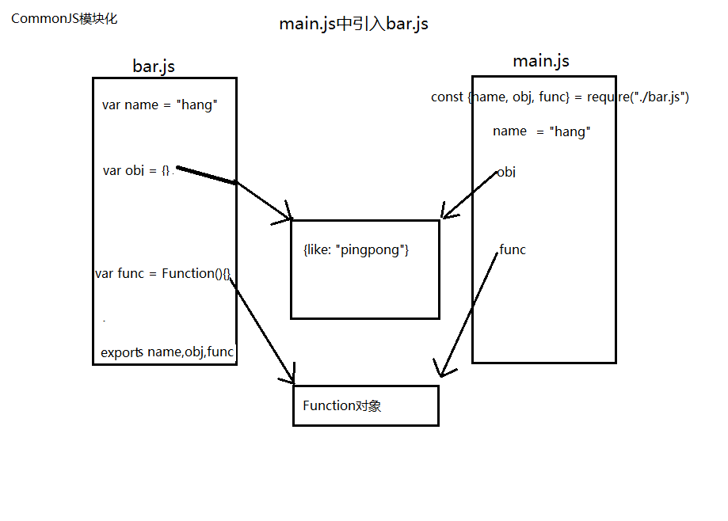
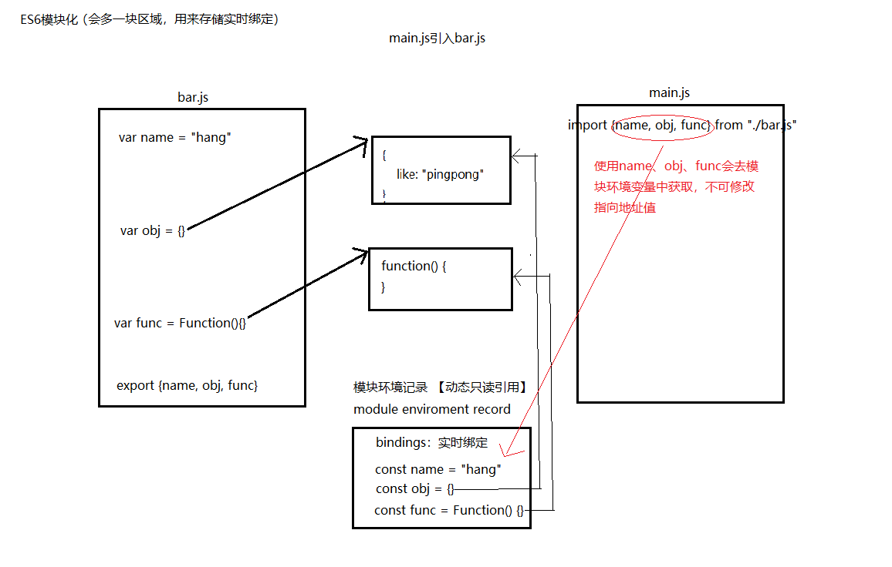

## 一、ECMAScript 基本语法

ECMAScript  是 JavaScript 标准的规范。

### （一）变量的命名

| 类型                   | 前缀 | 示例      |
| ---------------------- | ---- | --------- |
| 数组                   | a    | aValues   |
| 布尔型                 | b    | bFound    |
| 浮点型（数字）         | f    | fValue    |
| 函数                   | fn   | fnMethod  |
| 整型（数字）           | i    | iValue    |
| 对象                   | o    | oType     |
| 正则表达式             | re   | rePattern |
| 字符串                 | s    | sValue    |
| 变型（可以是任何类型） | v    | vValue    |

### （二）变量类型

所有的数据结构都是对象，最终的原型链都会指向Object（方法是prototype，对象是__ proto __）

**值类型(基本类型)**：字符串（String）、数字(Number)、布尔(Boolean)、对空（Null）、未定义（Undefined）

**引用数据类型**：对象(Object)、数组(Array)、函数(Function)

1. 检查变量或值的类型：

   ```javascript
   typeof obj;	//引用类型全部为object。特例：JS中null被认为是对象的占位符：object - 如果变量是一种引用类型或Null类型
   
   obj instanceof People;	//引用类型可以明确知道是哪种特定对象。无法判断基本类型和null、undefined
   
   // Object.prototype.toString.call()最准确最常用的方式，可以封装成工具类
   Object.prototype.toString.call('').slice(8,-1) === 'String';	//对结果进行截取比较[object String]，结果String、Number、Function、Null、Undefined、Array、Object、Boolean
   ```

2. Function

   ```javascript
   function testFunc() {
   }
   //当函数没明确返回值，返回的也是值"undefined"
   alert(testFunc() == undefined);  //输出 "true"
   ```

3. Number

   **对于浮点字面量的有趣之处在于，用它进行计算前，真正存储的是字符串。**

   ```javascript
   isFinite();	// 数值类型判断是否是无穷大
   
   isNaN();	// 判断非数（is Not a Number），更正常思维相反
   
   toFixed();	//方法返回的是具有指定位数小数的数字的字符串表示
   ```

4. String

   **它是唯一没有固定大小的原始类型。**

   ```javascript
   slice()/substring();	//用来截取字符串，在对负值处理上不同，substring将其作为0处理。
   ```

   **String拼接：**

   ```javascript
   var str = "hello ";
   str += "world";
   ```

   执行步骤如下：

   1. 创建存储 "hello " 的字符串。
   2. 创建存储 "world" 的字符串。
   3. 创建存储连接结果的字符串。
   4. 把 str 的当前内容复制到结果中。
   5. 把 "world" 复制到结果中。
   6. 更新 str，使它指向结果。

   每次完成字符串连接都会执行步骤 2 到 6；重复多次会非常消耗资源，造成性能问题。

   **优化1：**用 Array 对象存储字符串，然后用 join() 方法（参数是空字符串）创建最后的字符串

   ```javascript
   var arr = new Array();
   arr[0] = "hello ";
   arr[1] = "world";
   var str = arr.join("");
   ```

   数组中无论引入多少字符串都没问题，只有在执行join()方法才会发生连接操作。执行步骤如下：

   1. 创建存储结果的字符串
   2. 把每个字符串复制到结果中的合适位置

   **优化2：**对优化1进行封装

   ```javascript
   // 自定义函数
   function StringBuffer () {
     this._strings_ = new Array();
   }
   
   StringBuffer.prototype.append = function(str) {
     this._strings_.push(str);
   };
   
   StringBuffer.prototype.toString = function() {
     return this._strings_.join("");
   };
   ```

   ```javascript
   // 使用
   var buffer = new StringBuffer ();
   buffer.append("hello ");
   buffer.append("world");
   var result = buffer.toString();
   ```

   测试：当循环10000000次，直接+ 耗时1152ms，append耗时348ms

5. Object

   ECMAScript中的**所有对象都由Object对象继承而来**,Object对象中的所有属性和方法都会出现在其他对象中。

   Object属性：

   ```
   constructor：对创建对象的函数的引用（指针）。对于Object对象，该指针指向原始的Object()函数。
   
   Prototype：对该对象的对象原型的引用。对于所有的对象，它默认返回Object对象的一个实例。
   ```

   Object方法：

   ```
   hasOwnProperty(property);	判断对象是否有某个特定的属性。必须用字符串指定该属性。（例如，o.hasOwnProperty("name")）
   
   IsPrototypeOf(object);	判断该对象是否为另一个对象的原型。
   
   PropertyIsEnumerable;	判断给定的属性是否可以用for...in语句进行枚举。
   
   ToString();	返回对象的原始字符串表示。
   
   ValueOf();	返回最适合该对象的原始值。对于许多对象，该方法返回的值都与ToString()的返回值相同。
   ```

6. 数组

   

### （三）运算符

#### 位运算符

 1. 有符号整数（用户默认使用）：正数储存为原码，负数储存为补码。最高位32位为符号标识位，ECMAScript规定开发者不能访问符号位，所以在显示负整数的二进制字符串时，不以补码形式，而是数字绝对值的标准二进制前面加负号形式输出。

    ```javascript
    var iNum = -18;
    iNum.toString(2);	//输出 "-10010"
    ```

 2. 无符号整数：只有ECMAScript的位运算符才能创建无符号整数

### （四）语句

​	if/while/for/for-in/switch

### （五）函数

​	[参考文档](https://www.jianshu.com/p/80a2fb877168)

1. 函数内部特殊对象：arguments数组代表传入参数值，可不写参数。

2. **ECMAScript 的函数实际上是功能完整的对象。**Function 对象（类），其中的**原型property**属性使用较多。

3. 对象方法、类方法、原型方法

   ```javascript
   // 1. 函数声明
   function test() {}	//普通函数
   // 2. 函数表达式
   var test = function fn(){}	// 函数表达式：匿名函数（拉姆达表达式）,fn()将作为内部变量fn调用
   							// 相当于：var test ={ fn:  function()}
   //函数调用
   test();
   ```
   
4. 立即函数自调用：函数是有自己的作用域（相当于在函数私有作用域内声明变量，达到变量隔离的作用）

   ```javascript
   //所需知识: 括弧()里面不能包含 `函数声明` ，所以会将相应代码解析成 `函数表达式`
   
   //最外层括弧表示此处代表的是 `函数表达式`
   (function() {
       
   })
   //可以通过后面跟括弧()，表示函数表达式的执行
   (function() {
       
   })()
   
   //return 函数的返回值，与其他模块进行代码复用、交互
   var moduleVar = (function() 
   	return {
           name: "hang",
           age: function() {}
       }
   })()
   ```

5. es6出现的块级作用域，使得广泛使用的立即函数自调用不再是必要的，不使用var就好。

   1. 函数作用域：使用return 进行导出
   2. 块级作用不能导出变量

### （六）对象

​	1. 用完一个对象后，就将其废除o，来释放内存，这是个好习惯。object = null;

2. ECMAScript只支持晚绑定（late binding）指的是编译器或解释程序在运行前，不知道对象的类型。使用晚绑定，无需检查对象的类型，只需检查对象是否支持属性和方法即可。ECMAScript 中的所有变量都采用晚绑定方法。这样就允许执行大量的对象操作，而无任何惩罚。

3. ECMAScript只有公用作用域（没有私有），开发者统一规约在私有属性前后加下划线：

   ```javascript
   obj._color_ = "blue";
   ```

   注意，下划线并不改变属性是公用属性的事实，它只是告诉其他开发者，应该把该属性看作私有的。

4. **this关键字**：总是指向调用该方法的对象。

5. 定义类的方式演变至今较为成熟的方式。

   ```javascript
   // 1. 随用随定义
   var obj = new Object();
   obj.name = "hang";
   obj.age = '24';
   obj.printName = function() {
   	console.log(this.name);
   }
   // 问题：可能需要创建多个obj对象
   // 2. 工厂方式
   function createObj(mName, mAge) {
   	var obj = new Object();
       obj.name = mName;
       obj.age = mAge;
       obj.printName = function() {
           console.log(this.name);
       };
       return obj;
   }
   // 问题：每次调用createObi()方法都要创建新函数printName(),造成内存浪费。而事实上，应该是每个对象共	享同一个函数。
   // 3. 外部定义方法
   function printName() {
       console.log(this.name);
   }
   function createObj(mName, mAge) {
   	var obj = new Object();
       obj.name = mName;
       obj.age = mAge;
       obj.printName = printName();
       return obj;
   }
   // 问题：功能上：解决了重复创建函数对象的问题。语义上：该函数不太像是对象中的方法。
   // 4. 构造函数
   function Obj(mName, mAge) {
       this.name = mName;	//对象属性
       this.age = mAge;
       this.like = new Array['play', 'learn'];
       this.printName = function() {	//对象方法
           console.log(this.name);
       };
   }
   // 问题：还是存在2中重复创建函数对象的问题。也可用外部定义方法解决
   // 5.原型方式: 包含函数实例共享的方法和属性。函数运行时会先去本体的函数中去，没有会到prototype中	去找。
   function Obj() {  
   }
   Obj.prototype.name = 'hang';
   Obj.prototype.age = '24';
   Obj.prototype.like = new Array['play', 'learn'];
   Obj.prototype.printName = function() {	//原型方法
       console.log(this.name);
   };
   // 问题：当对象在原型中创建引用对象（此例中的like数组），创建的全部Obj对象的like指针不同，可是指向的	堆内存是同一块区域，即全部对象共享like属性。
   // 6.混合的构造函数/原型方法
   function Obj(mName, mAge) {
       this.name = mName;
       this.age = mAge;
       this.like = new Array['play', 'learn'];
   }
   Obj.prototype.printName = function() {
       console.log(this.name);
   };
   // 感觉还不是很完美
   // 7.动态原型方法	！！！！！！ (较为完善) ！！！！！！
   function Obj(mName, mAge) {
       this.name = mName;
       this.age = mAge;
       this.like = new Array['play', 'learn'];
       if(typeOf Obj.initialized == 'undefined') {
           Obj.prototype.printName = function() {
               console.log(this.name);
           };
       }
       Obj._initialized_ = true;
   }
   ```

6. 深浅拷贝

   ```javascript
   // 1. 浅拷贝 Object.assign()
   let obj1 = { person: {name: "kobe", age: 41},sports:'basketball' };
   let obj2 = Object.assign({}, obj1);
   
   // 2. 浅拷贝 展开运算符...
   let obj1 = { name: 'Kobe', address:{x:100,y:100}}
   let obj2= {... obj1}
   
   // 3. 浅拷贝 Array对象
   let arr = [1, 3, {
       username: ' kobe'
       }];
   let arr3 = arr.slice();
   ```

   ```javascript
   // 1.深拷贝 JSON.parse(JSON.stringify())：对象转字符串在解析成对象，不过，不能处理函数(null)和正则(空对象)
   let arr = [1, 3, {
       username: ' kobe'
   }];
   let arr4 = JSON.parse(JSON.stringify(arr));
   
   // 2.深拷贝 函数库lodash的_.cloneDeep方法
   var _ = require('lodash');
   var obj1 = {
       a: 1,
       b: { f: { g: 1 } },
       c: [1, 2, 3]
   };
   var obj2 = _.cloneDeep(obj1);
   console.log(obj1.b.f === obj2.b.f);// false
   
   // 3.深拷贝 jQuery.extend()
   var $ = require('jquery');
   var obj1 = {
       a: 1,
       b: { f: { g: 1 } },
       c: [1, 2, 3]
   };
   var obj2 = $.extend(true, {}, obj1);
   console.log(obj1.b.f === obj2.b.f); // false
   ```


### （七）继承机制


### （八）ES6

- let、const代替var

- 变量结构：返回多个值、解析json

- 新增Map和Set

  ```javascript
  //初始化对象
  let map = new Map([["age", 18], ["address", "河北省"]]);	//参数需要一个二维数组
  map.set("name", "hang")
  // for of(由Iterator支持) 适用于：Array、Object、String、Map、Set
  // for in 适用于: Array、Object、String
  // forEach 适用于: Set、Map
  for (let [key, value] of map) {
  console.log(key + " is " + value);
  }
  ```

- 箭头函数(一般当参数为函数时使用)：箭头函数内部没有this，内部没有this会向外层找

  > setTimeout(function() {console.log(this);})
  >
  > 内部函数调用时用的call()，会把window作为第一个参数传进去。

  ```javascript
  const obj = {
  	test() {
          //@1
  		setTimeout(function() {
  			console.log(this);	//window
  		})
          setTimeout(()=> {
              console.log(this);	//obj
          })
          //@2
          setTimeout(function() {
          	setTimeout(function() {
          		console.log(this);	//window
         		})
              setTimeout(() => {
          		console.log(this);	//window
         		})
          })
          //@3
          setTimeout(() => {
          	setTimeout(function() {
          		console.log(this);	//window
         		})
              setTimeout(()=> {
          		console.log(this);	//obj
         		})
          })
  	}
  }
  ```

- 对象增强

  ```javascript
  const name = "hang";
  const age = 18;
  const obj = {
  	//es5
  	//name: name,
  	//age: age,
      
  	//es6增强
  	name,
  	age
  }
  //遍历对象
  for(var i in obj) {
      console.log(i, ":", obj[i]);
  }
  ```

- 函数增强

  ```javascript
  const obj = {
  	//es5
  	//run: function() {},
  	//es6
  	run(){}
  }
  ```

- rest参数 add(...numbers)

- 解构赋值

- 模板字符串 `模板字符串示例$(name)`

- class关键字，extends继承（实际同es5修改原型链实现继承一样，只是要清晰）

- Promise解决异步操作问题：回调地狱

  > JavaScript 单线程执行；导致网络请求和浏览器事件都异步，使得页面较短时间内被渲染。

- 模块化：export 和 import

- ES8：async/await基于promise实现：更像同步代码，清晰明了

### （九）基于Babel的转码器

​	如何使用：[](https://www.yuque.com/ostwind/es6/docs-intro#a767126c)

​	Babel转码器普遍用于**将ES6语法转成ES5**。以下工具都是基于Babel：

1. **babel-cli**  

   将 es6+ 代码转成 向下兼容的语法（普遍是es5），同时将**ES6模块化转换成CommonJS模块化**语法（node环境下可以运行，浏览器不识别）

   ```js
   // 转码前
   export default {
   	printFunc
   }
   var printFunc = (name) => {
   	console.log(name);
   }
   
   // 转码后
   "use srtict";
   exports.default = {
       printFunc: printFunc
   };
   var printFunc = function ptintFunc(name) {
       console.log(name);
   }
   ```

   

2.  **Browserify**

   将语法转成最终浏览器可以识别语法。

3.  **ESlint**

   先使用Babel进行前置解码

   ```xml
   // .eslintrc
   {
     "parser": "babel-eslint",
     "rules": {
       ...
     }
   }
   ```

## 二、DOM编程

document object model文档对象模型，通过JS操作document进而动态修改html元素。

```javascript
// 获取html节点
document.getElementById("intro");

document.getElementsByTagName("p");

document.getElementsByClassName("intro");

//修改HTML内容、样式、元素
document.getElementById("p1").innerHTML="新文本!";

document.getElementById("p2").style.color="blue";

var para=document.createElement("p");
var node=document.createTextNode("这是一个新段落。");
para.appendChild(node);
var element=document.getElementById("div1");
element.appendChild(para);

parent.removeChild(child);

element.insertBefore(para,child);

parent.replaceChild(para,child);
//事件
onclick/onload/onunload/onchange/onmouseover/onmouseout/onmousedown/onmouseup

//获取根节点
document.documentElement - 全部文档
document.body - 文档的主体

```

## 三、BOM对象

Browser Object Model 浏览器对象模型，核心对象window。一个 window 对象实际上就是一个独立的窗口。

（一）全局作用域

​	window 是全局对象，因此所有的全局变量都被解析为该对象的属性。

```javascript
var a = "window.a";  //全局变量
function f () {  //全局函数
    console.log(a);
}
console.log(window.a);  //返回字符串“window.a”
window.f();  //返回字符串“window.a”
```

（二）客户端对象

- window：客户端 JavaScript 顶层对象。每当 <body> 或 <frameset> 标签出现时，window 对象就会被自动创建。
- navigator：包含客户端有关浏览器信息。
- screen：包含客户端屏幕的信息。
- history：包含浏览器窗口访问过的 URL 信息。
- location：包含当前网页文档的 URL 信息。
- document：包含整个 HTML 文档，可被用来访问文档内容及其所有页面元素。

**window**

1. 系统对话框

- alert()
- confirm()
- prompt()

2. 打开和关闭窗口

-  open() 
- 新创建的 window 对象拥有一个 opener 属性，引用打开它的原始对象
- close()

3. 定时器

- setInterval()：按照执行的**周期**（单位为毫秒）调用函数或计算表达式
- setTimeout()： 在指定的毫秒数后调用函数或计算表达式
- clearInterval()
- clearTimeout()

**navigator**：对象存储了与浏览器相关的基本信息，如名称、版本和系统等.window.navigator

**location**：对象存储了当前文档位置（URL）相关的信息，简单地说就是网页地址字符串。window.location

| 属性     | 说明                                                         |
| -------- | ------------------------------------------------------------ |
| href     | 声明了当前显示文档的完整 URL，与其他 location 属性只声明部分 URL 不同，把该属性设置为新的 URL 会使浏览器读取并显示新 URL 的内容 |
| protocol | 声明了 URL 的协议部分，包括后缀的冒号。例如：“http:”         |
| host     | 声明了当前 URL 中的主机名和端口部分。例如：“www.123.cn:80”   |
| hostname | 声明了当前 URL 中的主机名。例如：“www.123.cn”                |
| port     | 声明了当前 URL 的端口部分。例如：“80”                        |
| pathname | 声明了当前 URL的路径部分。例如：“news/index.asp”             |
| search   | 声明了当前 URL 的查询部分，包括前导问号。例如：“?id=123&name=location” |
| hash     | 声明了当前 URL 中锚部分，包括前导符（#）。例如：“#top”,指定在文档中锚记的名称 |

**history**：存储最近访问的、有限条目的 URL 信息。

```javascript
window.history.back(); / window.history.go(-1);
window.history.forward(); / window.history.go(1); 

window.history.length;

```

**screen**：客户端屏幕信息

**document**：

```javascript
document.documentElement.clientWidth;
document.documentElement.clientHeight;
```

### （四）作用域、闭包、原型链

作用域：全局作用域、局部作用域、块级作用域: (function(){})()

作用域链：变量会顺着父级一级一级向上搜索，直到找到为止，找不到就报错。

闭包：js为了实现数据和方法私有化的方式。原理：内层函数可以调用外层函数的变量和方法。

比如：实现每进入函数一次变量temp 加1

```javascript
// 1.定义全局变量
var temp = 0;
function incTemp() {
	return ++temp;
}
incTemp();
// 弊端：定义的全局变量，所有函数都可以看到使用

// 2.闭包
function addWarp() {
    var temp = 0;
    return function() {
    	return ++temp;
    }
}
var incTemp = addWarp();
incTemp();
```

### （五）事件代理和委托

> 原理：JS事件冒泡
>
> 描述：div > ul > li > a都绑定了click()事件，当点击a标签会从内向外触发事件：执行顺序a> li > ul > div。

冒泡案例：当点击li区域打印：1 ul div / 2 ul div / 3 ul div / 4 ul div ；点击ul区域打印：ul div

```html
<div onclick="console.log('div')">
    <ul onclick="console.log('ul')">
        <li onclick="console.log(1)">1</li>
        <li onclick="console.log(2)">2</li>
        <li onclick="console.log(3)">3</li>
        <li onclick="console.log(4)">4</li>
    </ul>
</div>
```

事件代理案例一：

```html
<div id="box">
    <input type="button" id="add" value="添加" />
    <input type="button" id="remove" value="删除" />
    <input type="button" id="move" value="移动" />
    <input type="button" id="select" value="选择" />
</div>

// 简单绑定：dom操作次数（四个按钮进行了四次dom操作）
<script>
    window.onload = function(){
        var Add = document.getElementById("add");
        var Remove = document.getElementById("remove");
        var Move = document.getElementById("move");
        var Select = document.getElementById("select");

        Add.onclick = function(){
       	 	alert('添加');
        };
        Remove.onclick = function(){
        	alert('删除');
        };
        Move.onclick = function(){
        	alert('移动');
        };
        Select.onclick = function(){
        	alert('选择');
        }
    }
</script>

// 优化：dom操作次数（只进行了一次dom操作）;
// 只简单冒泡当点击外层div时也会触发事件，如何跟直接在指定元素(input)绑定元素效果一样呢？
// Event对象提供了一个属性叫target，可以返回事件的目标节点，我们称为事件源。也就是说，target就可以表示为当前的事件操作的dom，但是不是真正操作dom，当然，这个是有兼容性的，标准浏览器用ev.target，IE浏览器用event.srcElement，此时只是获取了当前节点的位置，并不知道是什么节点名称，这里我们用nodeName来获取具体是什么标签名，这个返回的是一个大写的，我们需要转成小写再做比较（习惯问题）。

<script>
    window.onload = function(){
        var oBox = document.getElementById("box");
        oBox.onclick = function(ev) {
        	var ev = ev || window.event;
        	var target = ev.target || ev.srcElement;
        	if(target.nodeName.toLocaleLowerCase() == 'input'){
                switch(target.id){
                    case 'add' :
                        alert('添加');
                        break;
                    case 'remove' :
                        alert('删除');
                        break;
                    case 'move' :
                        alert('移动');
                        break;
                    case 'select' :
                        alert('选择');
                        break;
                }
            }
        }
    }
</script>
```

**适合用事件委托的事件：click，mousedown，mouseup，keydown，keyup，keypress。**

**focus，blur之类的，本身就没用冒泡的特性。**

### （六）Error错误/Exception异常处理

1. 错误Error：编译时错误，必须修正错误后才能运行。

2. 异常Exception：运行时异常，包括：

- Error ‰；是基本的错误类型，其他类型都继承自这个类型。
- EvalError；在使用 eval()函数而发生异常时被抛出
- RangeError ‰
- ReferenceError ‰
- SyntaxError ‰
- TypeError ‰；经常用到，在变量中保存着意外的类型时，或者在访问不存在的 方法时，都会导致这种错误
- URIError

3. 错误信息属性
   - description: 错误描述 (仅IE可用).
   - fileName: 出错的文件名 (仅Mozilla可用).
   - lineNumber: 出错的行数 (仅Mozilla可用).
   - message: 错误信息 (在IE下同description)
   - name: 错误类型.
   - number: 错误代码 (仅IE可用).
   - stack: 像Java中的Stack Trace一样的错误堆栈信息 (仅Mozilla可用).

4. 异常处理机制 ： 可以保证代码在执行过程中出现异常，不停止整个应用。

   4.1 try-catch-finally

   4.2 throw

   4.3 自定义异常

```javascript
function myException(message) {
	this.message = message;
	if(typeOf myException._initialized_ == 'undefined') {
		myException.prototype = new Error();
	}
	myException._initialized_ = true;
}
```

### （七）[同步任务、异步任务](https://www.jianshu.com/p/0ddd86a145ef)

**同步任务**：会进入主线程，按照代码顺序执行。

**异步任务**：不会进入主线程，而是进入“任务队列”，只有任务队列通知主线程，某个异步任务可以执行了，该任务才会进入主线程。像文件的读取和ajax请求等耗时操作。

> 1. 宏观任务队列：setTimeout, setInterval等。
>
>  	2. 微观任务队列：promise, process.nextTick(当读取到第一个nextTick，就会一次性从队列中执行全部nextTick)
>

**事件循环**：主线程从任务队列中读取事件，这个过程是循环不断的。

### （八）JSON

一种轻量级的数据交换格式，主要用于存储和传输数据的格式

```javascript
var str = '{ "sites" : "yy" }';
var obj = JSON.parse(str);	//将json字符串转成js对象
var strr = JSON.stringify(obj);	//将js字符串转成json对象
```

### （九）[异步方式](https://www.jianshu.com/p/8bc48f8fde75)

1. 原生ajax：不适用于异步顺序执行。**底层使用XMLHttpRequest对象**

   ```javascript
   $.ajax({
      type: 'POST',
      url: url,
      data: data,
      dataType: dataType,
      success: function () {},
      error: function () {}
   });
   ```

2. ajax集合promise实现异步顺序执行。

   > `**Promise**` 对象是一个代理对象（代理一个值），被代理的值在Promise对象创建时可能是未知的。它允许你为异步操作的成功和失败分别绑定相应的处理方法（handlers）。

   ```javascript
   // 1 .把 ajax 返回成功 / 失败的回调封装成一个 Promise 对象（同时判断 resolve / reject 状态）
   // 2 .其对象根据传来的状态 resolve 则执行.then( res => {} // 实际在Promise.prototype上 )来执行ajax一层返回成功后的二层 ajax 请求，状态为 reject 的则执行对象的.catch( err => {} // 实际在Promise.prototype上 )，以此类推，实现异步请求的顺序执行
                                  
   const ajaxPromise = obj => {
           return new Promise((resolve, reject) => {
               $.ajax({
                   type: obj.type,
                   url: obj.url,
                   data: obj.data,
                   success: res => {
                       resolve(res);      // 请求成功则转成Promise对象并判断为resolve状态
                   },
                   error: err => {
                       reject(err.status);      // 请求失败则转成Promise对象并判断为reject状态
                   }
               })
           })
       } 
   
       /*
           函数1：判断用户登陆成功
        */
       let userLogin = () => {
           // 第一次执行ajaxPromise
           ajaxPromise({
               type: 'get',
               url: 'test.php',
               data: { userName: 'Verin', userPwd: '123456'}
           }).then(res => {
               console.log('后台校验提交的数据并返回成功信息');        // 成功则二次ajax请求，取用户信息
               getUserInfo(res);
           }).catch(err => {
               console.log('用户校验提交的数据失败，无法登陆');
           })
       }
   
   ```

3. axios：基于promise对原生XMLHttpRequest的封装。（主流）

   ```javascript
   axios({
       method: 'post',
       url: '/user/12345',
       data: {
           firstName: 'Fred',
           lastName: 'Flintstone'
       }
   })
   .then(function (response) {
       console.log(response);
   })
   .catch(function (error) {
       console.log(error);
   });
   ```

4. fetch：：对promise封装，**没有使用XMLHttpRequest对象**

5. async和await的使用：[async和await](https://www.jianshu.com/p/b4fd76c61dc9)

### （十）正则表达式

```
var patt =  /^\d+$/;	//判断是否全部为数字
var val = "123456";
console.log(patt.test(val));
```

# 二、前端模块化

### （一）CommonJS: require、exports对象

同步加载模块，需要使用打包工具将CommonJS特有语法打包（exports、require等），使用browserify进行打包。运行时才能确定模块间依赖关系、输入、输出变量。	

```javascript
// 总结：node中实现的commonjs模块化思路，实际是浅拷贝(引用拷贝)
// 每个js文件都有单独的model对象，最终导出只不过是向model.exports指向的堆内存中保存值.
// bar.js
model.exports = {};  

// moduleVar指向和model.exports相同的堆内存地址.
// main.js
const moduleVar = require("./bar.js");
```



### （二）AMD：

非同步加载模块，可以使用回调函数。需将导出模块进行统一，较为繁琐。运行时才能确定模块间依赖关系、输入、输出变量。

```javascript
	define(['module1', 'module2'], function(m1, m2){
	   return 模块
	})
	require(['module1', 'module2'], function(m1, m2){
		//加载完成执行该函数
	   使用m1/m2
	})
```


### （三）CMD：

可同步、可异步

```javascript
	model.exports = {};  
	require('./module2') /  require.async('./module3', function (m3) {
								console.log('异步引入依赖模块3  ' + m3.API_KEY)
							})
```


### （四）ES6：import、export关键字

模块静态化，编译时确定模块间依赖关系，以及输入输出的变量。

```javascript
export {name, age}   //导出的是非对象形式，不是es6对象中key value简写形式，相当于标签，import判断有没有这个标签，没有会报错。
import {name, age} from "./bar.js"
import  * as bar from "./bar.js"

export default name	// 一个模块只能导出一个default
import myName from './bar.js'

import().then(res=> {
    res.name;
}) //以上是关键字，此处属于import函数，返回Promise对象，异步加载。
```

```javascript
// ES Module默认使用严格模式：use strict (模块加载js时不允许通过协议file：读取文件，需用到live serve模拟小型服务器)
<script src="./bar.js" type="module"></script>
```



CommonJS 和ES6区别：

**CommonJS**

	1. 对于基本数据类型，属于复制。即会被模块缓存。在另一个模块中可以对该模块输出的变量重新赋值，使用require命令引入的基本数据类型，不同模块间不会影响。
	2. 对于复杂数据类型，属于浅拷贝。由于两个模块引用的对象指向同一个内存空间，因此对该模块的值做修改时会影响另一个模块。
	3. 模块加载：当使用require命令加载某个模块时，是加载的整个导出对象，只有运行完整个模块的代码才能得到完整的对象，导致完全没办法在编译时做“静态优化”，未找到就相当于获取对象中不存在的属性返回undefined。
	4. 当使用require命令加载同一个模块时，不会再执行该模块，而是取到缓存之中的值。也就是说，CommonJS模块无论加载多少次，都只会在第一次加载时运行一次，以后再加载，就返回第一次运行的结果，除非手动清除系统缓存。

**ES6**

 	1. ES6模块中的值属于【动态只读引用】。
 	2. 对于只读来说，即不允许修改引入变量的值，import的变量是只读的，不论是基本数据类型还是复杂数据类型。当模块遇到import命令时，就会生成一个只读引用。等到脚本真正执行时，再根据这个只读引用，到被加载的那个模块里面去取值。
 	3. 对于动态来说，原始值发生变化，import加载的值也会发生变化。不论是基本数据类型还是复杂数据类型。
 	4. 模块加载：当使用import命令加载某个模块时，不需要加载全部的导出，只是一个只读引用。只会获取所需的变量，其他不会被加载。


