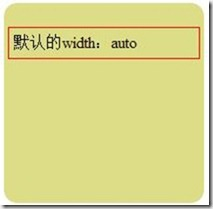
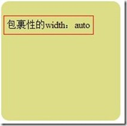
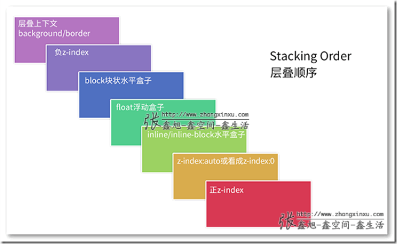

# 自适应布局

1. 尺寸：盒子模型
2. 定位：
   1. CSS：浮动、普通流、绝对定位
   2. CSS3：transform、弹性盒子flex、grid模块

## 一、尺寸

html开始之前记得设置以下属性：

```html
<html style="width: 100%; height: 100%">
<body style="width: 100%; height: 100%">
```

清除body的外边距：

```css
body {
  margin: 0;
}
```


### （一）百分比 %

​	百分比是相对父节点的，随着浏览器尺寸的变化而改变。通过百分比将浏览器尺寸和元素尺寸联系起来，达到自适应。

### （二）宽度方向 auto

​	auto是 <span style="color: red"> **非包裹性的块级元素** </span> 在<span style="color: red"> **宽度** </span> 相对父元素的默认值 *（块级元素的margin、border、padding以及content宽度之和等于父元素width）*，由浏览器自动计算。

  		1.  自适应屏幕宽度 width: auto;	
    		2.  相对父元素水平居中 margin: 0 auto;	


<span style="color: red"> **当div具有包裹性，就不能使用auto来适应父级宽度。**</span>

​	margin: 0 auto; 没有生效的原因：(1)没有为该元素设置宽度，也就没有办法参考父元素的宽度来进行自身margin的auto。(2)div具有包裹性，即脱离标准流。没有可供参考的父元素宽度进行自身margin的auto。

问题：那为什么margin：auto对不能计算垂直方向的值呢？

回答：很简单，垂直方向是被设计成可以无限扩展的，内容越多浏览器便产生滚动条来扩展，所以垂直方向都找不到一个计算基准，以此返回一个false，便成了0。


**包裹性**：父元素的<span style="color: red">宽度</span>是由内部元素撑开。

​	`float:left/right;`、`position:absolute/fixed;`、

​	`display:inline/inline-block/table-cell/inline-flex`

<div >
    
    
    <div style="float: right;line-height: 100px;margin: 0 20px;">
        图一：文字所在div宽度 = 父元素宽度<br/>
        图二：文字所在div宽度 = 文字的宽度
    </div>
    <div style="clear:both"></div>
</div>

​	共性：都属于BFC，即页面上的一个隔离的独立容器，容器里面的子元素不会影响到外面的元素。

​	

**非包裹性**：

​	`简单div;`、`position:relative;`、`display:block/flex;`、`overflow:全部;`、`zoom:`


测试代码：

```html
<!DOCTYPE html>
<html style="width: 100%; height: 100%">
    <head>
        <style>
            body {
                margin: 0;
            }
            .fatDiv {
                width: calc(100% - 2px); 
                height: 100px; 
                border: 1px red solid;
            }
            .chiDiv {
                width: auto; 
                height: 50px;
                margin-right: 100px; 
                border: 1px blue solid; 
                /* zoom: 3; */
                /* overflow: visible; */
                /* display: inline-block; */
                /* float: left; */
                /* position: absolute; */
            }
        </style>
    </head>
    <body style="width: 100%; height: 100%">   
        <div class="fatDiv">
            <div class="chiDiv">
            
            </div>
        </div>
    </body>
</html>
```

### （三）高度方向

​	<span style="color: red"> **高度方向：外边距重叠，外边距auto为0。**</span>float后垂直方向边距不会重叠。

## 二、定位

### （一）float浮动

**适合：元素高度统一，实现顶端对齐的等高排列。**float元素会处于同一层，空间不够时会被挤下去。

使用浮动记得<span style="color: red"> **在外层div:after设置 `clear:both;`**</span>清除浮动，防止父元素的高度会坍塌。

```css
#container::after { 
  content: "";
  display: block; 
  clear: both;
}
```


> margin实现水平垂直居中

问题：既然浮动元素脱离了文档流，为什么文字会环绕在浮动元素的周边而不是跟浮动元素重合呢？

回答：绝对定位absolute会将元素彻底的从文档流中删除，并相对父元素定位，不会影响其他元素布局。

而float后还是会影响其他元素布局，避免浮动元素盖住其他元素。

以下是float元素，可以看出文字是围绕浮动元素的，而背景色却在浮动层下方。


        <div style="width:100px; height: 100px; background-color: rgba(235, 20, 20, 0.3); float:left"></div>
        <div style="width:200px; height: 200px; background-color: blue;">
            最近还好1！最近还好2！最近还好3！最近还好4！
            最近还好5！最近还好6！最近还好7！最近还好8！
        </div>
以下是absoult，不会影响其他元素任何布局。

        <div style="width:100px; height: 100px; background-color: rgba(235, 20, 20, 0.3); position:absolute"></div>
        <div style="width:200px; height: 200px; background-color: blue;">
            最近还好1！最近还好2！最近还好3！最近还好4！
            最近还好5！最近还好6！最近还好7！最近还好8！
        </div>	

**使用float实现圣杯布局、双飞翼布局：两者都是先加载中间部分，额外引入<div>标签，其目的是为了既能使中间产生浮动，又能使中间自适应屏幕宽度（浮动后属于包裹元素，不能width:auto自适应宽度），为两侧预留空间。**

**圣杯布局**：

```html
<!DOCTYPE html>
<html style="width: 100%; height: 100%">
    <head>
        <link href="index.css" rel="stylesheet" type="text/css"/>
    </head>
    <body style="width: 100%; height: 100%">
       	<div id="header"></div>
        <div id="container" >
            <div id="center" class="column"></div>
            <div id="left" class="column"></div>
            <div id="right" class="column"></div>
        </div>
        <div id="footer"></div>
    </body>
</html>
```

```css
body {
  margin: 0;
  /* 200px左侧宽度 + 150px右侧宽度 + 300px中间预留 */
  min-width: 650px;
}
#container {
  width: auto;
  height: 100%;
  padding-left: 200px;
  padding-right: 150px;
}
#container .column {
  float: left;
}
#container::after {
  clear: both;
}
#center {
  width: 100%;
  height: 100%;
  background: red;
}
#left {
  width: 200px;
  height: 100%;
  margin-left: calc(-100% - 200px);
  background: green;
}
#right {
  width: 150px;
  height: 100%;
  margin-right: -150px;
  background: blue;
}
```

**双飞翼布局**

```html
<!DOCTYPE html>
<html style="width: 100%; height: 100%">
    <head>
        <link href="index.css" rel="stylesheet" type="text/css"/>
    </head>
    <body style="width: 100%; height: 100%">
       	<div id="header"></div>  
        <div id="container" >
            <div id="center" class="column"></div>
        </div>
        <div id="left" class="column"></div>
        <div id="right" class="column"></div>
        <div id="footer"></div>
    </body>
</html>
```

```css
body {
    margin: 0;
    /* 200px左侧宽度 + 150px右侧宽度 + 300px中间预留 */
    min-width: 650px; 
  }
  #container {
    width: 100%;
    height: 100%;
  }
  .column {
    float: left;
  }
  #container::after {
    clear: both;
  }
  #center {
    width: auto;
    height: 100%;
    margin-left: 200px;
    margin-right: 150px;
    background: red;
  }
  #left {
    width: 200px;
    height: 100%;
    margin-left: -100%;
    background: green;
  }
  #right {
    width: 150px;
    height: 100%;
    margin-left: -150px;
    background: blue;
  }
```

### （二）inline-block文本流

**横向布局，元素高度可以不统一**。

> margin实现水平垂直居中


问题1：设置display: inline-block的元素会有4px左右的空隙，这个是因为写代码时的换行符所致。

所需知识：html中空格和回车可以通过font-size: 0 来清空

解决：在inline-block的父元素中设置样式：font-size: 0; letter-spacing: -4px;然后设置inline-block的所有兄弟元素font-size和letter-spacing的值恢复正常显示。

问题2：垂直方向对齐

解决2：inline-block的基准有些麻烦，在使用inline-block元素加上vertical-align: top/bottom/middle 使行内元素的基准对齐。

**双飞翼布局**

```html
<!DOCTYPE html>
<html style="width: 100%; height: 100%">
    <head>
        <link href="index.css" rel="stylesheet" type="text/css"/>
    </head>
    <body style="width: 100%; height: 100%">
        <div id="header"></div>
        <div id="center" class="column"></div>
        <div id="right" class="column"></div>
        <div id="left" class="column"></div>
        <div id="footer"></div>
    </body>
</html>
```

```css
body {
    margin: 0;
    /* 200px左侧宽度 + 150px右侧宽度 + 300px中间预留 */
    min-width: 650px; 
    font-size: 0px;
    letter-spacing: -4px;

  }
  .column {
    display: inline-block;
    vertical-align: middle;
  }
  #center {
    width: calc(100% - 350px);
    height: 100%;
    margin-left: 200px;
    background: red;
  }
  #left {
    width: 200px;
    height: 80%;
    margin-left: calc(-100%);
    background: green;
  }
  #right {
    width: 150px;
    height: 50%;
    background: blue;
  }
```

### （三）绝对定位

**宽度自适应仍然使用auto和100%，位置由top/bottom/left/right等控制。**

**父相对定位、子绝对定位**。

> 水平垂直居中：
>
> ​	1. 设置`margin:auto;`并设置top、left、right、bottom的值**相等即可**，不一定要都是0。
>
> 	2. 让left和top都是50%，再用transform向左（上）平移它自己宽度（高度）的50%


### （四）CSS3 flex弹性盒子

一般配合rem进行屏幕适配，移动端应用使用较多。

属性参考：http://www.ruanyifeng.com/blog/2015/07/flex-grammar.html


### （五）其他

​		其实**position：relative和CSS3中的transform**都可以实现定位，但是由于他们在原来的普通流中还占着一个坑，所以很少用来布局啥的。


1.当`position`为`absolute/fixed`时，元素已脱离文档流，再对元素应用float失效（即不起作用）。

2.当`position`为`static/relative`时，元素依旧处于普通流中，再对元素应用`float`起作用。


### 布局实例

[css布局练习总结]: https://www.jianshu.com/p/6c41d9068b73

