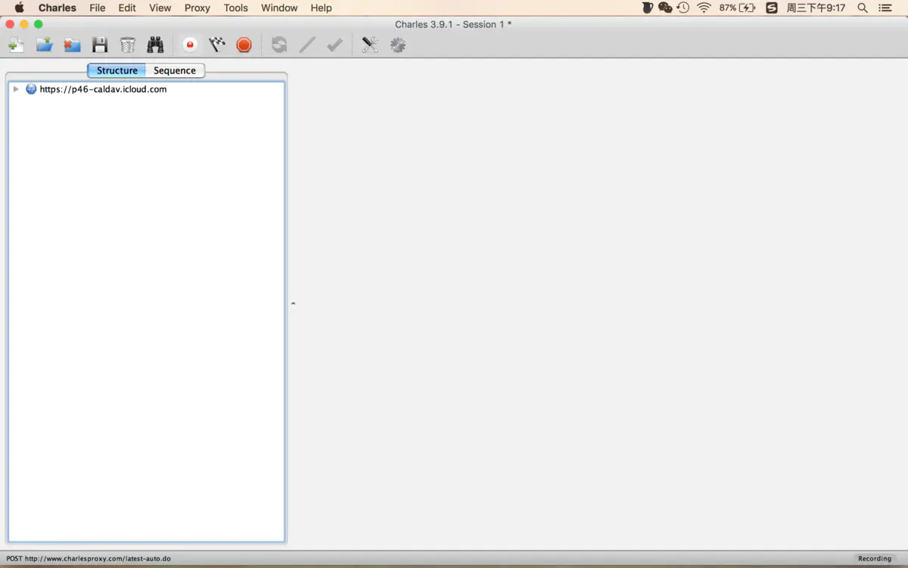
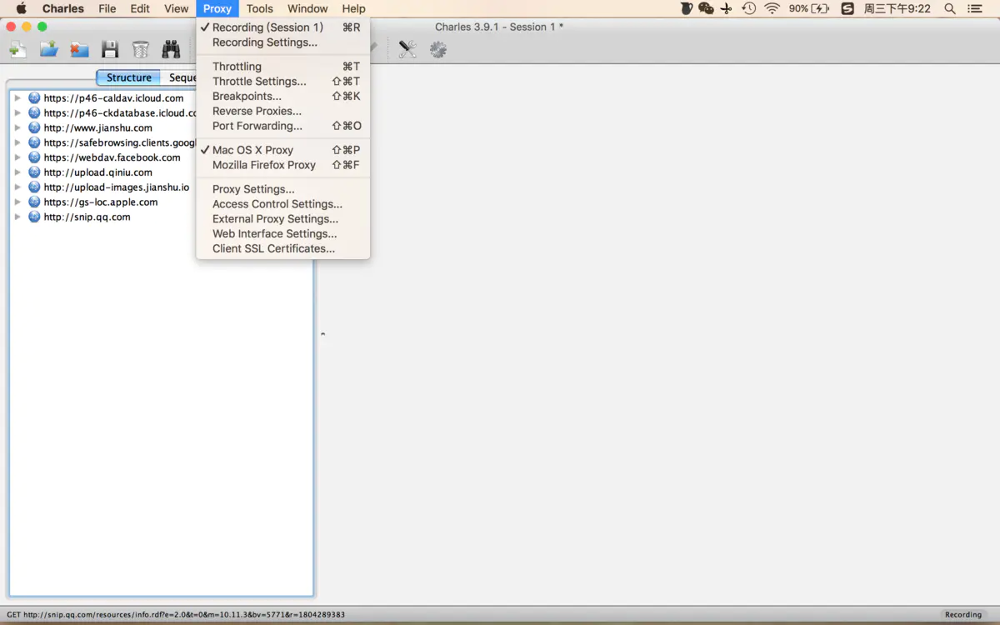
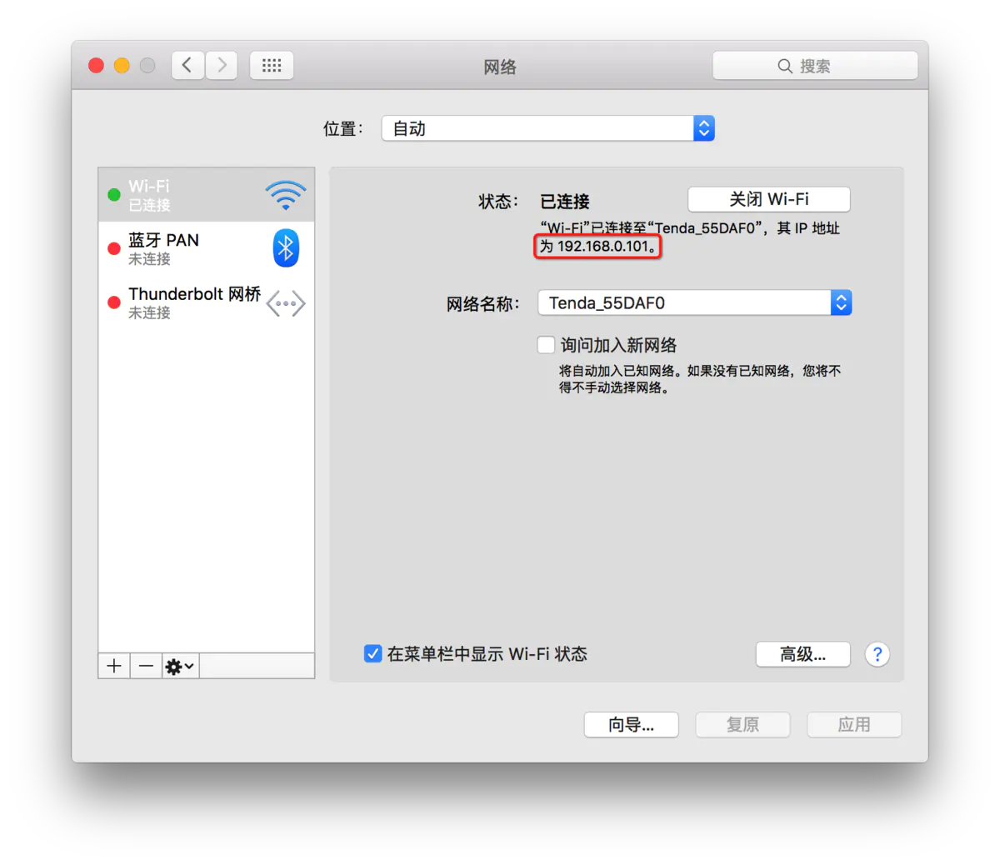
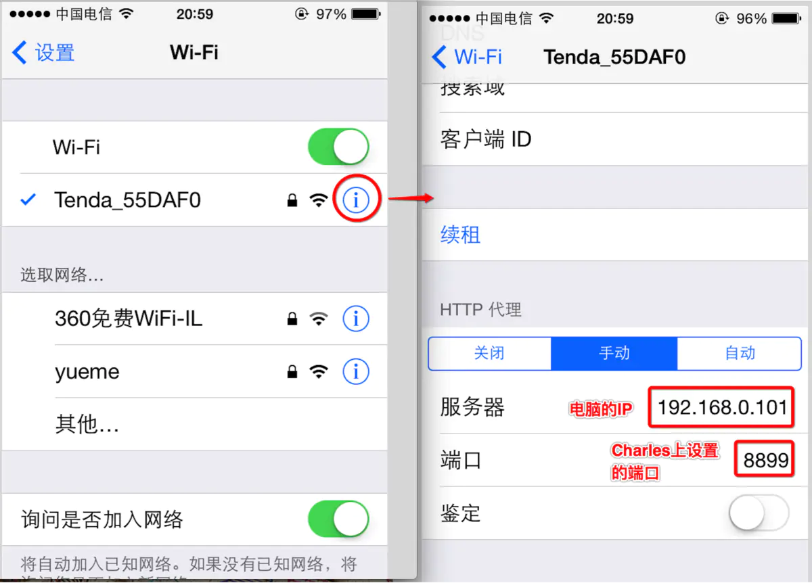
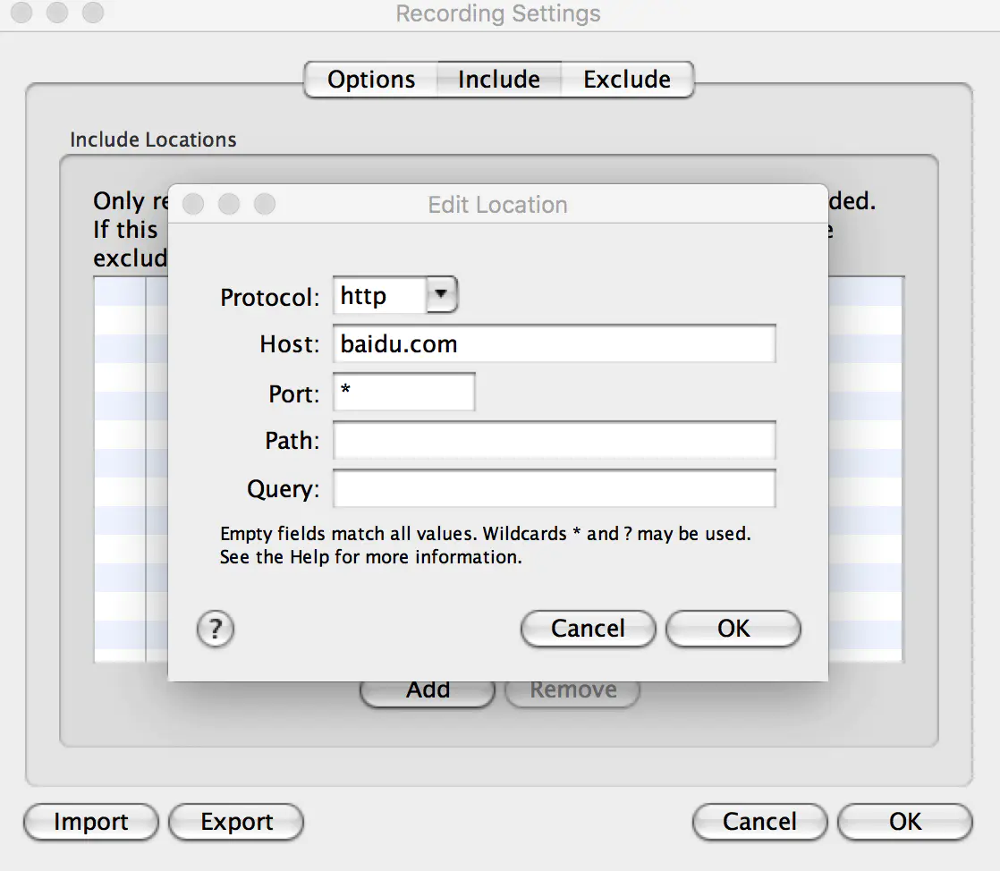
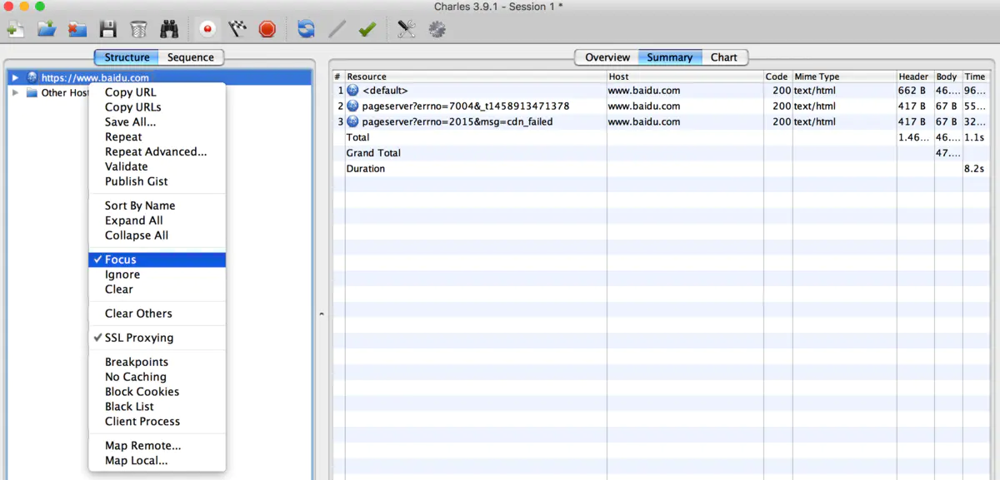
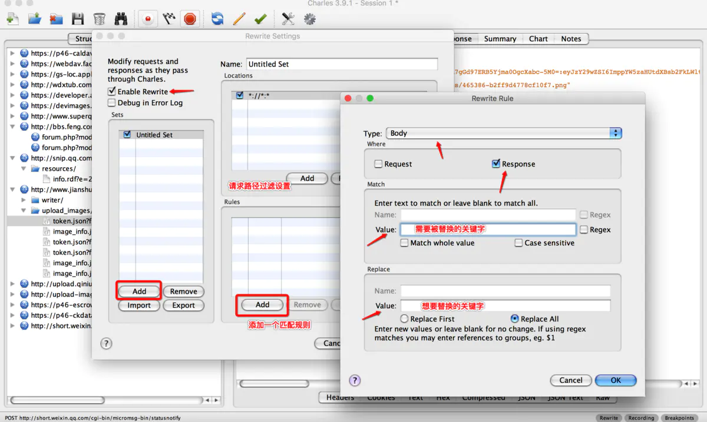

### 下载与安装

charles官方下载地址：https://www.charlesproxy.com/

获取激活码网站： [https://www.charles.ren](https://links.jianshu.com/go?to=https%3A%2F%2Fwww.charles.ren)

[简介]: https://www.jianshu.com/p/fdd7c681929c	"引自"

Charles其实是一款代理服务器，通过成为电脑或者浏览器的代理，然后截取请求和请求结果达到分析抓包的目的。该软件是用Java写的，能够在Windows，Mac，Linux上使用。开发iOS都在Mac系统上吧，安装Charles的时候要先装好Java环境。这么好的软件不是免费的，[官网](https://link.jianshu.com?t=http://www.charlesproxy.com)要好几十刀呢，我这里有一个Mac上的破解版，[点击这里下载](https://link.jianshu.com?t=http://pan.baidu.com/s/1qXoCiwW)，当然不是最新版的。如果你想体验最新版，Charles是提供试用的。

### Charles主要功能

- 支持SSL代理。可以截取分析SSL的请求。
- 支持流量控制。可以模拟慢速网络以及等待时间（latency）较长的请求。
- 支持AJAX调试。可以自动将json或xml数据格式化，方便查看。
- 支持AMF调试。可以将Flash Remoting 或 Flex Remoting信息格式化，方便查看。
- 支持重发网络请求，方便后端调试。
- 支持修改网络请求参数。
- 支持网络请求的截获并动态修改。
- 检查HTML，CSS和RSS内容是否符合W3C标准。

### 开始抓包

先看一下Charles的庐山真面目吧！

接下来要把电脑设置为代理

这样你会发现，你通过浏览器请求的网址都会出现在这里，iOS模拟器的所有的网络请求也会出现在这里。点击某一个网址后，你会发现右边会出现这个网址请求的大概信息，点击具体的请求后会出现request和response等信息

如果你发现返回的是乱码，首先看是在http请求还是https请求，如果是http请求，那么应该就是返回来的中文乱码,解决方案是找到该软件显示包内容，Contents目录下的info.plist，打开文件找到`vmoption`,添加`-Dfile.encoding=UTF-8`即可。

如果是https请求出现的乱码，如下图这种情况

这时候你就需要安装Charles的CA证书了，首先到去 [http://www.charlesproxy.com/ssl.zip](https://link.jianshu.com?t=http://www.charlesproxy.com/ssl.zip) 下载CA证书文件。双击crt文件，选择总是信任就可以了，当然如果要抓取iPhone设备上的HTTPS请求，需要在iPhone上也安装一个证书，在手机浏览器输入这个网址：[http://charlesproxy.com/getssl](https://link.jianshu.com?t=http://charlesproxy.com/getssl) ，点击安装即可。然后你就可以告别那烦人的乱码，可以愉快地抓包了。如果这时候你还是抓不了的话，检查一下Proxy-->SSL Proxying Settings是否设置OK，设置参考下图：add （Host为空，Port：443（主要用于https服务））

### 抓取真机上的包

抓取真机上的数据非常的简单，首先使手机和电脑在一个局域网内，不一定非要是一个ip段，只要是同一个路由器下就可以了。按照上面说的把证书安装好，然后找到电脑的IP，你可以选择在终端输入`ifconfig en0`来获取，也可以选择打开网络偏好设置来查看。

终端获取IP

网络偏好设置查看IP

接下来打开Charles的代理设置：`Proxy->Proxy Settings`，设置一下端口号，默认的是8888，这个只要不和其他程序的冲突即可,并且勾选`Enable transparent HTTP proxying`。

端口号设置

在手机上连接上和电脑在同一局域网的网络上设置HTTP代理。端口号就是刚刚在Charles上设置的那个。

然后在手机上随便打开一个网址，这是Charles会弹出一个框让你确认是否代理，点击allow就可以了，然后你就会在Charles上发现手机上的请求了。

### 过滤

在 Charles 的菜单栏选择 `Proxy->Recording Settings`，然后选择 `Include` 栏，选择`Add`，然后填入需要监控的协议，主机地址，端口号,这样就达到了过滤的目的。如下图：

 还有一种方法就是在一个网址上右击，选择`Focus`，然后其他的请求就会被放到一个叫Other Host的文件夹里面，这样也达到了过滤的目的。

### 断点

断点的功能搞开发不会不知道，在Charles发起一个请求的时候，我们是可以给某个请求打一个断点的，然后来观察或者修改请求或者返回的内容，但是在这过程中药注意请求的超时时间问题。要针对某一个请求设置断点，只需要在这个请求网址右击选择Breakpoints就可以断点某一个请求了。

### 模拟网速慢

有时候在开发的时候我们想要模拟一下网络慢的情况，这时候Charles他是可以帮助到你的，在`Proxy`->`Throttle Setting`，然后选择`Enable Throttling`，在`Throttle Preset`下选择网络类型即可，具体设置你可以自行拿捏。

### 请求重定向

请求重定向的作用是什么呢？开发中一般都是测试环境，如果我们想对比一下和线上版本的区别的话，可以讲测试的请求重定向到正式环境下。在选择 `Tools`->`Map Remote下：

### 内容替换

有时候我们会测一下请求的参数不同会带来不同的返回结果以测试是否达到业务需求，或者需要不同的返回结果来验证我们对数据的处理是否正确，这时候需要后台的同事配合，但是有了Charles，我们可以自己把控接口返回来的内容，比如数据的空与否，数据的长短等等。在`Tools`->`Rewrite Settings`下：

