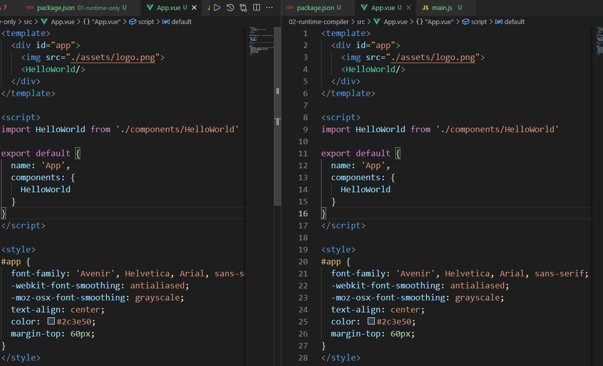
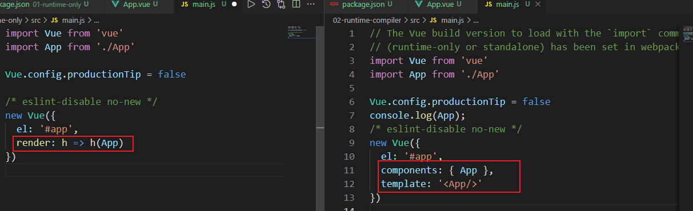
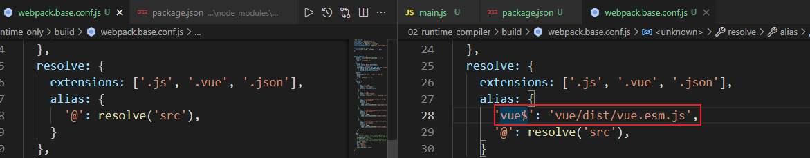
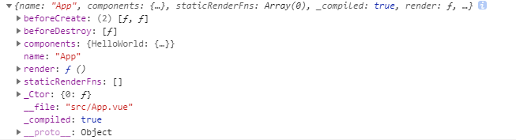
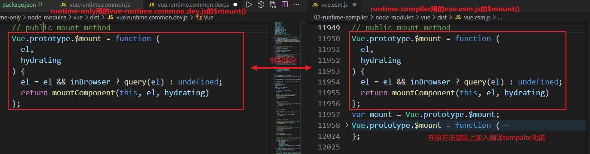
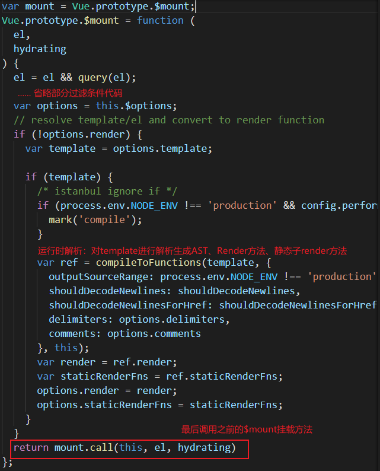

# Runtime-Only 和 Runtime-Complier区别

## 一、项目构建

### 1）为了能更加清晰的找到代码所在位置，使用 **Vue-Cli2.0** 脚手架构建项目。

```bash
1. 全局安装vue-cli2.0（node和npm请自行安装）
npm intall vue-cli -g
2. 生成vue-cli2.0项目模板
vue init webpack 01-runtime-compiler	//runtime-compiler
vue init webpack 01-runtime-only	//runtime-only
```

### 2）构建项目时会让选择：Runtime Only 版本的还是 Runtime + Compiler 版本


### 3）项目对比（左侧runtime-only，右侧runtime-compiler）

#### 1. package.json完全相同，此处注意 **vue-template-compiler**，会将.vue编译成JavaScript生成render函数

<div></div>

#### 2. App.vue完全相同

<div></div>

#### 3. main.js，使用Vue构造函数初始化时参数：render和template的区别

<div></div>

#### 4. webpack.base.config.js对 ***import Vue from ‘vue’*** 引入的不同（详细代码会在后面代码解析部分说明）

1. runtime-compiler对vue引入别名，最终指向：**<span style="color: red">node_modules/vue/dist/vue.esm.js</span>**
2. runtime-only未对vue起别名，最终指向：node_modules/vue/package.js 文件中main: **<span style="color: red">dist/vue.runtime.common.js</span>**（文件引入规则，参考10node.md）

<div></div>

## 二、加载过程

<span style="color: red">通过vue构建的项目，每个模块(.vue文件)都会经历 **.vue -> AST抽象语法树  ->  render函数 ->  Vnode -> 真实dom**。</span>

#### 1. runtime-compiler：上述阶段全程在代码运行时进行。

#### 2. runtime-only结合vue-loader、vue-complete-compiler加载器进行代码编译阶段优化。

 1. vue-loader结合vue-complete-compiler：.vue -> ast -> render（该阶段在代码编译阶段，将.vue文件加载后最终生成render（）函数）

    - vue-complete-compiler是从vue源码 src/complier和src/sfc中抽取出来的一部分，用作.vue解析成JS对象，生成AST、生成render函数。[参考：vue-loader&vue-template-compiler详解](https://blog.csdn.net/ligang2585116/article/details/104576582)
- 通过 **import App from './App'**引入的.vue会直接转成带有render()函数的对象。
    
<div>
        
    </div>
    
2. runtime-only: render -> vnode -> 页面

## 三、代码解析

### $mount()挂载方式不同

runtime-comiler在原$mount方法基础上，增加了解析tempalte生成render()函数



拓展功能：

<div>
    
</div>


### 四、总结

- Runtime Only

我们在使用 Runtime Only 版本的 Vue.js 的时候，通常需要借助如 webpack 的 vue-loader 工具把 .vue 文件编译成 JavaScript，因为是在编译阶段做的，所以它只包含运行时的 Vue.js 代码，因此代码体积也会更轻量。

- Runtime + Compiler

我们如果没有对代码做预编译，但又使用了 Vue 的 template 属性并传入一个字符串，则需要在客户端编译模板，如下所示：

```js
// 需要编译器的版本
new Vue({
  template: '<div>{{ hi }}</div>'
})

// 这种情况不需要
new Vue({
  render (h) {
    return h('div', this.hi)
  }
})
```

因为在 Vue.js 2.0 中，最终渲染都是通过 `render` 函数，如果写 `template` 属性，则需要编译成 `render` 函数，那么这个编译过程会发生运行时，所以需要带有编译器的版本。

很显然，这个编译过程对性能会有一定损耗，所以通常我们更推荐使用 Runtime-Only 的 Vue.js。

### 参考文章：

[vue-loader&vue-template-compiler详解](https://blog.csdn.net/ligang2585116/article/details/104576582)

[Runtime Only VS Runtime + Compiler](http://caibaojian.com/vue-analysis/prepare/build.html#runtime-only-vs-runtime-compiler)

