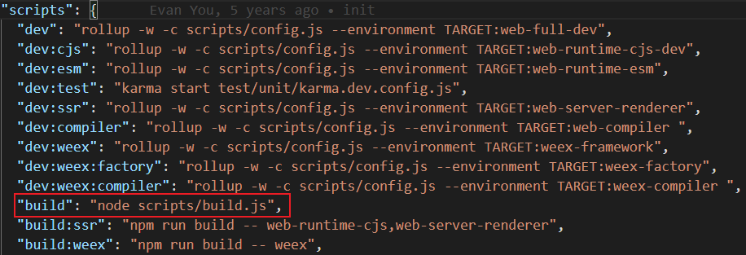
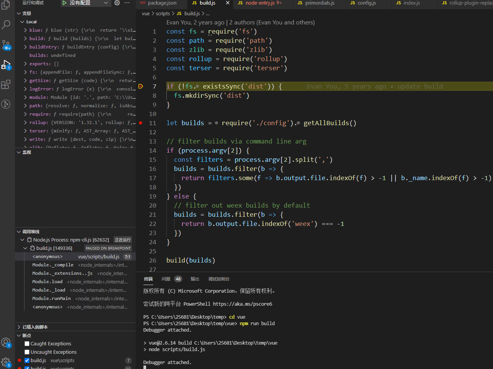
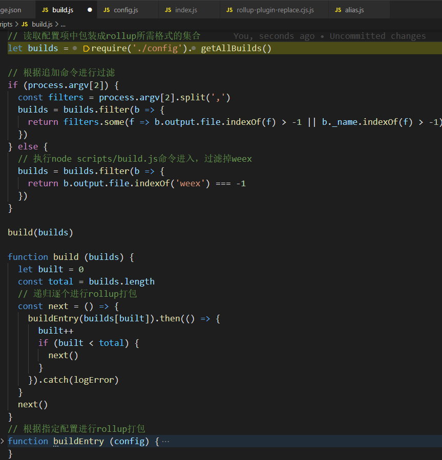
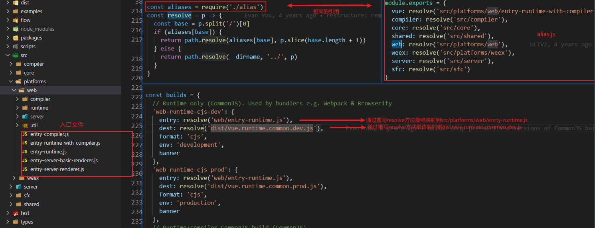
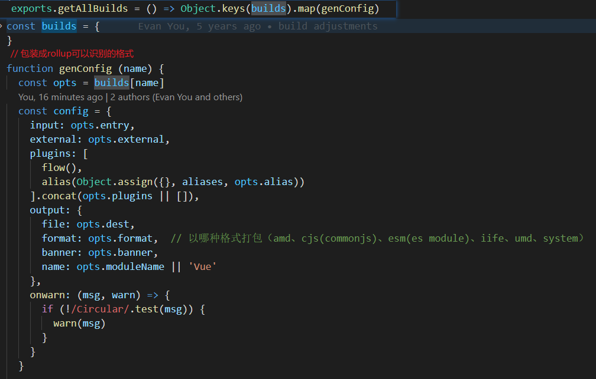

# Vue.js构建过程

## 一、源码下载

**Github地址**：[https://github.com/vuejs/vue](https://github.com/vuejs/vue)

```shell
git clone git@github.com:vuejs/vue.git	// 克隆git库到本地（git自行下载学习）

cd vue // 进入vue文件夹

// 安装所需依赖

// 1.npm 命令phantomjs-prebuilt依赖无法下载
npm install 
cnpm install phantomjs-prebuilt@2.1.16 --save-dev 

// 2.cnpm
cnpm install
```

## 二、打包效果

将dist文件夹删除，执行：

```shell
npm run build
```

打包后生成dist文件夹下各个不同用途的vue

<div></div>

## 三、vue.js打包构建过程

### 1. package.json入手

查看package.json中scripts: build命令，找的是scripts/build.js文件。

<div></div>

### 2. 断点调试

进入build.js文件打上断点，终端输入:

```shell
npm run build
```

<div></div>

### 3. build.js文件

1. 首先读取config中包装过后的配置对象builds（入口、出口、以哪种格式导出、所需插件）
2. 根据命令node scripts/build.js后续追加条件对 builds 进行过滤
   1. node scripts/build.js -- web-runtime-cjs,web-server-renderer
   2. node scripts/build.js 默认去除配置集合中weex相关打包
3. build()函数对 打包集合builds 递归逐个通过rollup进行打包。[Rollup](https://zhuanlan.zhihu.com/p/27832148)将ES6模块编译为AMD、CommonJS、UMD等模块化代码。

<div></div>

## 4. config.js文件

- 将所有类型进行rollup所需格式进行包装导出

<div></div>

<div></div>