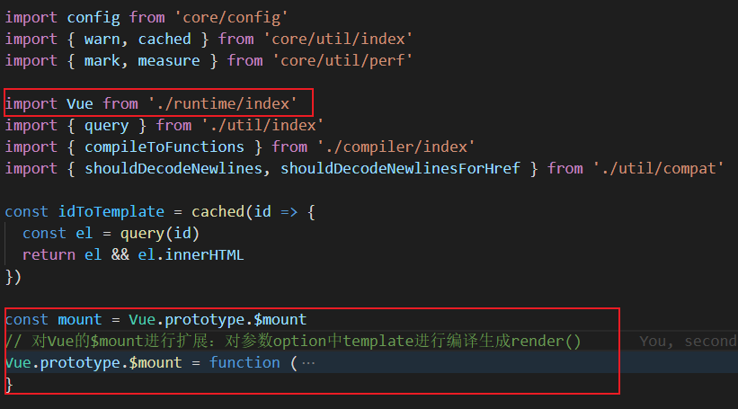
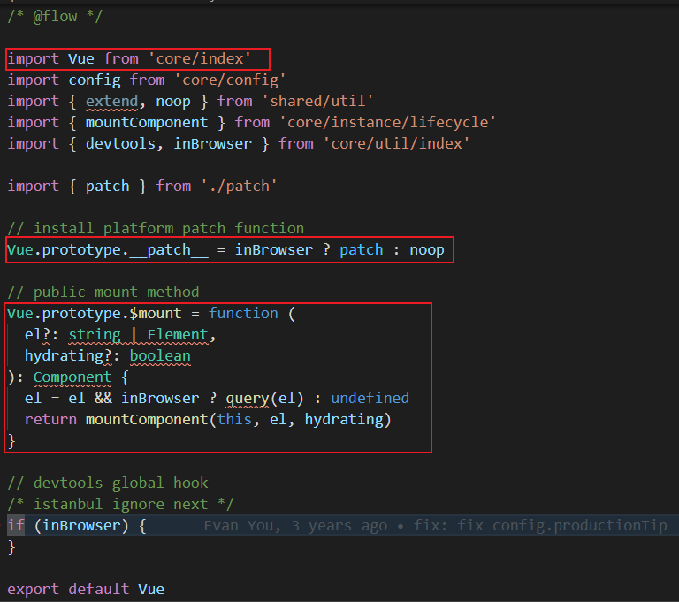
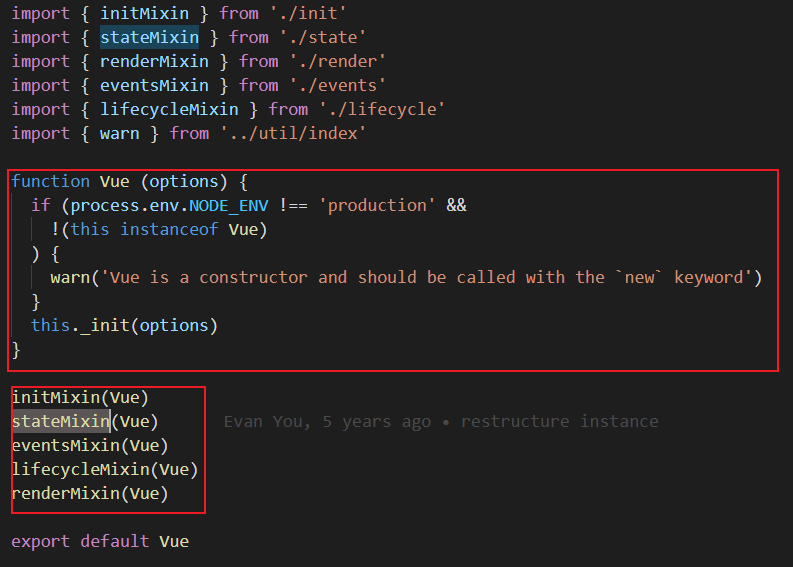
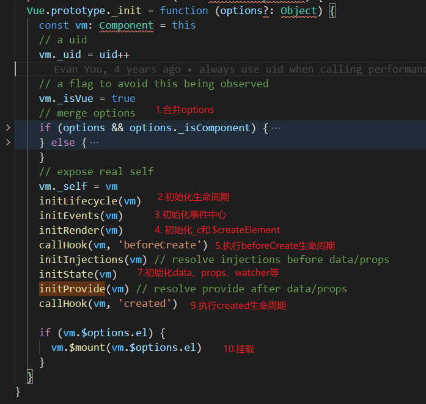

# Vue源码解析

## 一. 所需知识点

### 1. Object.defineProperty(obj, prop, descriptor)

**Object.defineProperty() ** 直接在对象上定义新属性并为属性绑定所需特性。

- enumerable: 可枚举性
- configurable: 是否允许删除该属性、添加描述符
- writable: 是否允许为value赋值（不能和set、get同时使用）
- value: 该属性对应的值
- set(): 为属性赋值时做相应处理
- get(): 获取该属性时做相应处理

```js
/* 
* 优化：将Object.defineProperty包裹在方法内部，将value保存在局部作用中，就不用每个都手动定义变量。
*/
var reactiveFunc = function(obj, key, value) {
  // Object.defineProperty方法内部的get、set需要一个变量存储当前的value值
  // 函数内部就是一个局部作用域, 这个 value 就只在函数内使用的变量 ( 闭包 )
  Object.defineProperty(obj, key, {
    configurable: true,
    enumerable: true, // 可枚举
    get () { // 如果使用 obj.key 来访问数据, 就会调用 get 方法 ( getter, 读取器 )
      console.log(`读取${key}: ${value}`);
      return value;
    },
    set ( newVal ) { // 如果 obj.key = 'xxx', 那么就会调用 这个 set 方法, 并设置的值会最为参数传入 set
      console.log(`赋值的${key}新值为: ${newVal}`);
      value = newVal;
    }
  })
}

var reactiveObj = {name: "hang"}

reactiveFunc(reactiveObj, "age", 12);

//name属性不是通过Object.defineProperty定义的变量，所以没有做拦截处理
reactiveObj.name

//age属性为响应式，读取和赋值会触发对应的set和get
reactiveObj.age
reactiveObj.age = 15

// 输出：
//   读取age: 12
//   赋值的age新值为: 15
```

### 2.观察者模式

- node自带 **EventEmitter**挂载事件并触发

  ```js
  // 引入 events 模块
  var events = require('events');
  // 创建 eventEmitter 对象
  var eventEmitter = new events.EventEmitter();
  
  // 绑定事件及事件的处理程序
  eventEmitter.on('eventName', ()=> {
    console.log("---------");
  });
  
  // 触发事件
  eventEmitter.emit('eventName');
  ```

- 自己实现

  ```js
  // Observe.js
  class Observe {
      constructor() {
          this.container = new Map();
      }
      /* 绑定 */
      on(key, value) {
          if (this.container.has(key)) {
              let arr = this.container.get(key);
              arr.push(value);
          }
          else {
              this.container.set(key, [value]);
          }
      }
      ;
      /* 触发指定回调函数 */
      emit(key) {
          if (this.container.has(key)) {
              let arr = this.container.get(key);
              arr.forEach(element => {
                  element();
              });
          }
      }
      /* 删除 */
      delete(key, callback) {
          let err = "";
          let succ = "";
          if (this.container.has(key)) {
              this.container.delete(key);
              succ = `${key}:删除成功`;
          }
          else {
              err = `${key}:不存在绑定事件`;
          }
          callback(err, succ);
      }
      /* 删除 Promise*/
      deletePro(key) {
          return new Promise((reslove, reject) => {
              if (this.container.has(key)) {
                  this.container.delete(key);
                  reslove(`${key}:删除成功`);
              }
              else {
                  reject(`${key}:不存在绑定事件`);
              }
          });
      }
  }
  exports.Observe = Observe;
  ```

  ```js
  // CreateObserve.js
  let CallBack = require("./Subject")
  
  class CreateObserve extends CallBack.Observe {
    constructor(name) {
      super();
      this.subName = name;
    };
    on(func) {
      super.on(this.subName, func);
    };
    delete(callback) {
      super.delete(this.subName, callback);
    };
    deletePro(callback) {
      return super.deletePro(this.subName, callback);
    };
    doSomething(func) {
      if(func instanceof Function) {
        func();
      }
      super.emit(this.subName);
    }
  }
  
  module.exports = CreateObserve
  ```

  ```js
  // 使用
  var CreateObserve = require('./observer/CreateObserve')
  
  let sub = new ConcreteSubject("test");
  sub.on(()=> {console.log("--------");});
  sub.doSomething();
  sub.delete((err, succ) => {
    if(err) {
      console.log(err);
      return;
    }
    console.log(mess);
    console.log(succ);
  });
  sub.deletePro().then((res)=> {
    console.log(res);
  }).catch((err)=> {
    console.log(err);
  })
  ```

## 二、源码解析

### 1.目录结构

```
src
├── compiler        # 编译相关(生成AST、AST静态树)，此阶段可以在构建时借助vue-loader编译（推荐），或者运行时借助带有compiler功能的vue.js编译。
├── core            # 核心代码 
	├── components		# 内置组件
	├── global-api		# 全局 API 封装
    ├── instance		# Vue 实例化
	├── observer		# 观察者
	├── util			# 工具函数
	├── vnode			# 虚拟 DOM
├── platforms       # 不同平台的支持
├── server          # 服务端渲染
├── sfc             # 将单个.vue 文件解析成JavaScript对象
├── shared          # 共享工具函数代码
```

### 2.简易源码解析

以 **web/entry-runtime-with-compiler.js** （以**Runtime+compiler**方式构建项目）为例，主要讲解核心代码，部分代码会省略。

#### 1) 入口文件 web/entry-runtime-with-compiler.js 核心：

	- runtime/index文件引入Vue
	- 在原Vue.$mount()基础上进行拓展

<div></div>

#### 2) platforms/web/runtime/index核心：

- core/index引入Vue
- 实现Vue.prototype.$mount()方法挂载模板
- 实现Vue.prototype._ __patch_ _ _方法

<div></div>

#### 3) core/index核心：

- instance/index引入Vue
- 初始化Vue全局 Api

<div></div>

#### 4) instance/index核心

- 在**new Vue()** 前，向Vue.prototype中混入方法
  - initMixin()：初始化 **Vue.prototype._init**
  - stateMixin()：初始化 **Vue.prototype.$watch**
  - eventsMixin()：初始化 **Vue.prototype中的$on、$once、$off、$emit**
  - lifecycleMixin()：初始化 **Vue.prototype中的_update、$forceUpdate、$destroy**
  - renderMixin()：初始化 **Vue.prototype中的$nextTick、_render**
- 初始化Vue方法并执行 _init 方法

<div></div>

#### 5）instance/init核心

- 合并options配置：当new vue(options)参数中包含有mixins属性时，要将其进行合并。
- initLifecycle()：初始化生命周期，即Vue属性并附初值，包含$parent、$children、$refs等属性。
- initEvents()：初始化事件中心，Vue._events属性。
- initRender()：初始化渲染，**vm._c用于被模板编译生成的render使用、Vue.$createElement用于用户手写的render使用**
- callHook(vm, 'beforeCreate')：**首先将当前模板（vue）对应的Watcher放入全局唯一的Dep.target属性**，执行beforeCreate生命周期函数，**最后将当前Dep.target赋值成上一个Watcher**
- initInjections()
- initState()：初始化 data、props、computed、watcher 等等（后面详细讲解）
- initProvide()：
- callHook(vm, 'created')：执行created生命周期函数
- vm.$mount(vm.$options.el)：挂载到指定dom

<div></div>

#### 6）core/observer/index核心：数据响应式处理

​	递归为每个对象 / 数组中的属性进行响应式处理， `defineReactive` 中为每个属性创建对应 `Dep` 对象，通过 `Object.defineProperty`重写属性：

- 在 `get` 获取属性值时进行依赖收集（Dep与全局Watcher进行关联）
- 在 `set ` 修改属性值时派发更新（遍历当前deps<Watcher>，将watcher添加到队列中，在下一个滴答  `nextTick` 执行 `vm._update(vm._render()` 更新页面）

#### 7）$mount挂载方法

1. 首先，它对 `el` 做了限制，Vue 不能挂载在 `body`、`html` 这样的根节点上。接下来的是很关键的逻辑 —— 如果没有定义 `render` 方法，则会把 `el` 或者 `template` 字符串转换成 `render` 方法。（运行时编译较为消耗性能 ）
2. 调用 `mountComponent()` 函数，核心：
   - `callHook(vm, 'beforeMount')` 
   - new Watcher(vm, () => {vm._update(vm._render(), hydrating)})：初始化Watcher时将回调函数保存到对象中，数据更新（没有同步标识）时会在下一个tick `nextTick` 执行回调函数更新页面。想要操作更新后的dom，就必须在 `nextTick` 后执行。
     - 将当前watcher赋值给全局唯一Watcher `Dep.target`
     - 执行`vm._update(vm._render(), hydrating)`
       - vm._render：该render函数由 `createCompiler` 生成，其中使用到函数科里化，将AST作为局部变量存储。最终都会调用 `createElement` 方法通过AST结合data生成VNode。中间会访问 `vm` 上的数据，这时候就会触发数据对象的getter，进行依赖收集 `dep.depend()`（将当前数据对象对应的Dep对象与当前全局的唯一Watcher关联）.
       - vm._update：进行 `vm.__patch__` 新旧vnode比较，进行页面更新.
     - 将全局Watcher赋值上一个watcher
   - `callHook(vm, 'mounted')`

## 参考文章

详细Vue源码解析参考: [Vue.js 技术揭秘](http://caibaojian.com/vue-analysis/)