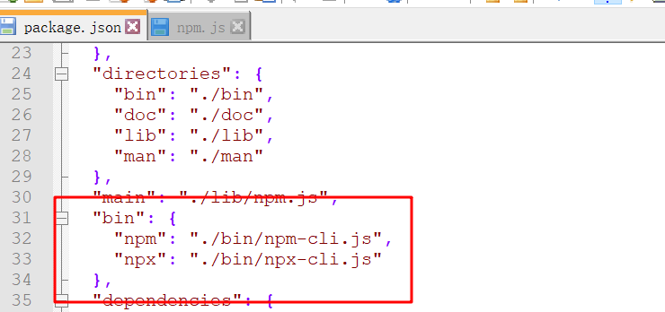

### （一）修改全局安装、缓存配置

##### 		1.1 全局安装目录查看：

```
		npm config list
```

> 我是修改后的，系统默认的都是在C:\Users\Administrator\AppData\Roaming\npm


##### 		1.2 修改全局安装路径和缓存路径：	

>  	在安装nodejs的目录下创建node_global、node_cache文件夹


```swift
    npm config set prefix "D:\Program_Software\nodejs\node_global"
    npm config set cache "D:\Program_Software\nodejs\node_cache"
```

> 更换完成就可以将C:\Users\用户盘下两个文件删除


### （二）全局安装 和 局部安装 使用场景

#### 	（1）全局安装

```
	npm install <pageName> -g//（这里-g是-global的简写）
```

#### 	（2）本地安装

```
npm install <pageName> (后面可以加几种修饰符，主要有两种--save-dev和--save)
```

#### 	（3）全局安装作用

​    **全局安装的包可提供直接执行的命令**，(例：gulp -h可以查看gulp定义了什么命令)。 比如gulp全局安装后，可以在命令行上直接执行gulp -v、gulp -h等（原理：全局安装的gulp会将其package.json中的bin命令注入到了全局环境，使得你可以全局执行：gulp xxx命令）



**倘若只在本地安装了gulp，未在全局安装gulp，直接执行这些命令会报错**。你想要执行相应的命令则可能需要例如：node ./node_modules/gulp/bin/gulp.js -v(查看版本) 这样用一大串命令来执行。

当然，不是每个包都必须要全局安装的，**一般在项目中需要用到该包定义的命令才需要全局安装。**比如gulp <taskName>执行gulp任务...等，所以是否需要全局安装取决于我们如何使用这个包。**全局安装的就像全局变量有点粗糙，但在某些情况下也是必要的，全局包很重要，但如果不需要，最好避免使用。**

#### （4）局部安装作用

​	1.1 如果只是全局安装了而没本地安装，就得require('<pagePath>') 例：引入一个全局的包可能就是requirt('/usr/local/....')通过全局包的路径引入，这样显然十分的不灵活。如果安装了本地包，那么就**可以直接require('<pageName>')引入使用。**

​	1.2 一个包通常会在不同的项目上会重复用到，如果只全局安装，那么当某个项目需要该包更新版本时，更新后可能就会影响到其他同样引用该包的项目，因此本地安装可以更灵活地在不同的项目使用不同版本的包，并避免全局包污染的问题。


<span style="color:red"> **一个经验法则：要用到该包的命令执行任务的就需要全局安装，要通过require引入使用的就需要本地安装**（ 但实际开发过程中，我们也不怎么需要考虑某个包是全局安装还是本地安**装，因为这一点在该包的官网上一般会明确指出，以上是为了理解全局安装和本地安装）。**</span>

### （三）开发环境和生产环境

>1. 保存到开发依赖(devDependencies): npm install <pageName> --save-dev
>
>2. 保存到生产(上线)依赖(dependencies): npm install <pageName> --save


【开发环境】：指的是你的项目尚且在编码阶段时的环境。你在代码可能还有各种console.log()、注释、格式化等。
【生产环境】：指的是你的项目已经完成编码，并发布上线可供用户浏览的阶段时的环境。代码可能经过了压缩、优化等处理。

#### （1）生产依赖

​	**我们下载的jQuery，在开发时参与源码编写，在发布上线的生产环境中也是需要它的。不仅在开发环境编写代码时要依赖它、线上环境也要依赖它，因此将它归类为"生产依赖"。**安装时执行npm install jquery --save，它就会被记录在package.json的dependencies。当进行代码打包时，会将这里的jQuery打包入我们的项目代码中。

#### （2）开发依赖

​	假如我们用gulp对html进行压缩，我们通常会用到一个插件gulp-htmlmin。我们只希望它把html压缩完就ok了，并不希望它融入我们的项目代码中，即只存在于开发环境，因此把他归类为"开发依赖"。安装时执行npm install gulp-htmlmin --save-dev它就会被记录在package.json的devependencies下，当进行代码打包时，不会将这里的gulp-htmlmin插件源码打包入我们的项目代码中。


<span style="color:red">**devDependencies只会在开发环境下使用，生产环境不会被打入包内；而dependencies不仅在开发环境中要使用，生产环境也需要使用到。**根据以上规则，我们就很容易区分哪些插件是用--save-dev模式安装，哪些用--save模式安装。</span>