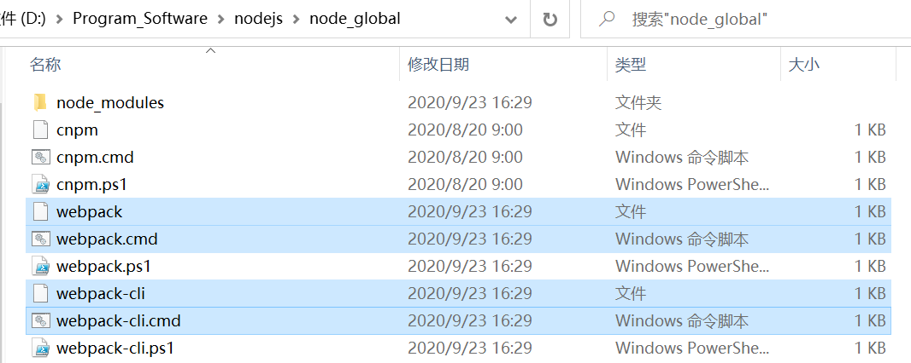

<span style="color:red">错误：webpack : 无法将“webpack”项识别为 cmdlet、函数、脚本文件或可运行程序的名称。请检查名称的拼写，如果包括路径，请确保路径正确，然后再试一次。</span>

首先：查看自己npm全局安装路径下是否有以下文件。



其次：查看自己项目本地是否安装webpack


- 解决1：使用package.json的scripts脚本，在项目的package.json中新增"webpack": "webpack"（npm scripts）


```
  "scripts": {
    "test": "echo \"Error: no test specified\" && exit 1",
    "webpack": "webpack"
  },
```

使用命令（不过webpack命令还是不能直接使用）

```
npm run webpack ./src/index.js -o ./build/built.js --mode=development
```

**原因：每当执行`npm run`，就会自动新建一个 Shell，会将当前目录的`node_modules/.bin`子目录加入`PATH`变量（其中就带有webpack.cmd执行命令），执行结束后，再将`PATH`变量恢复原样。这意味着，当前目录的`node_modules/.bin`子目录里面的所有脚本，都可以直接用脚本名调用，而不必加上路径。**

- 解决2：在环境变量path加入你npm全局下载路径（我的是	D:\Program_Software\nodejs\node_global）

这样今后全局安装的命令都可以直接进行使用。